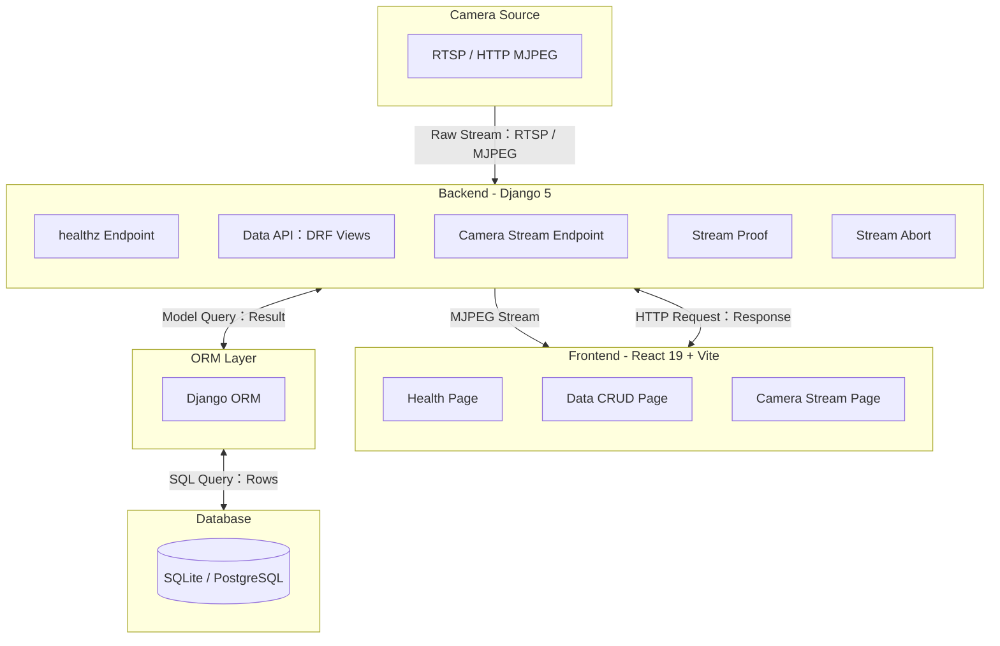
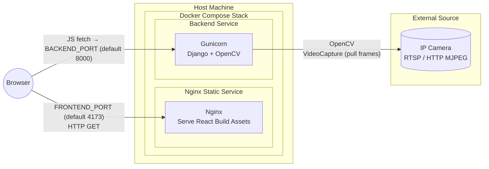
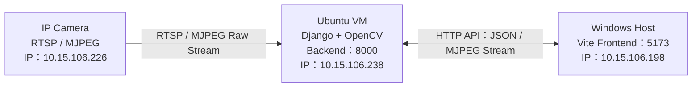
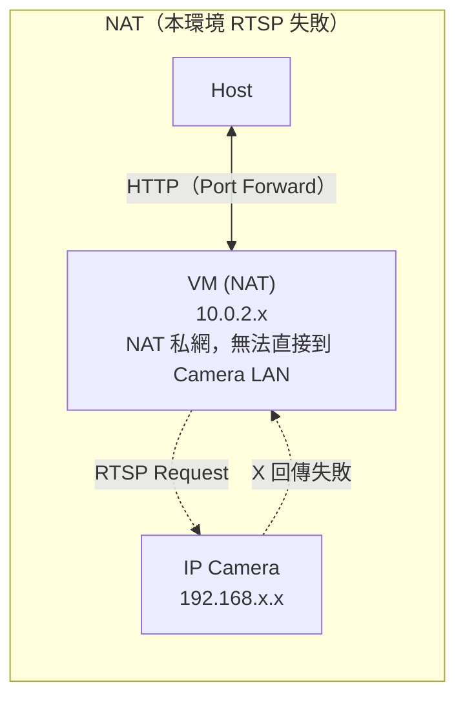
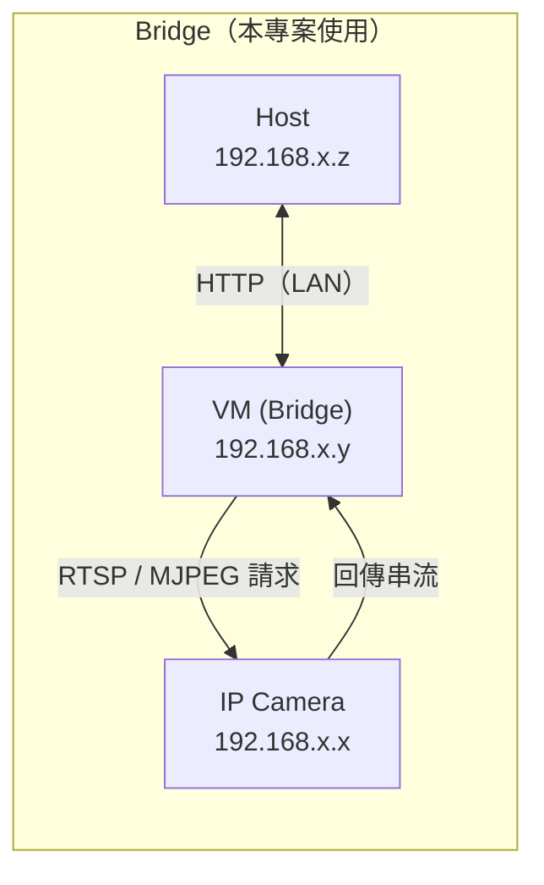

# React × Django Camera Demo

以 React 19 + Vite 結合 Django 5 + OpenCV 的全端示範專案，聚焦「資料 CRUD + 即時影像串流」的整合驗證。此報告整理系統架構、技術組件、功能亮點、開發流程、部署方式，以及完整 API 清單與測試/故障排除資訊。

---

## 1. 專案概述
- **目標**：在單一倉庫中建立可操作的 CRUD 介面與 MJPEG 串流代理，展示跨端協作與容器化交付流程。
- **應用情境**：內部控管工具、教學示範、快速 PoC；可延伸加入影像辨識、權限控管等研究題目。
- **成果**：Health / Data / Camera 三頁 React 介面、對應 Django API、OpenCV 串流處理、Docker Compose 部署腳手架。

---

## 2. 系統架構


**區塊解說**
- **Frontend**：React + Vite 介面，包含 Health / Data / Camera 三個頁面，負責觸發 fetch 與更新 UI。
- **Backend**：Django + OpenCV，提供 CRUD (`/data/`)、健康檢查 (`/healthz/`) 與串流控制 (`/stream/*`)；OpenCV 由 `camera` app 負責影像處理。
- **ORM / DB**：Django ORM 連結 SQLite（可換 PostgreSQL），處理 migrations 與查詢。
- **Camera Source**：實體或虛擬攝影機（RTSP / HTTP MJPEG），透過 OpenCV 捕捉並轉成 MJPEG 串流給前端 ``。

### 2.2 Docker 部署架構（Mermaid）


**說明**
- Docker Compose 僅包含兩個服務：`frontend` 使用 nginx 提供 `/usr/share/nginx/html` 內的 React Build（`frontend/Dockerfile` 會先在 Node 20 環境建置，再 COPY 至 nginx image），`backend` 則以 `gunicorn config.wsgi:application` 直跑 Django + OpenCV。
- 沒有額外的反向代理層。瀏覽器存取 `FRONTEND_PORT`（預設 `4173→80`）取得靜態檔案，Build 時就把 `VITE_API_BASE_URL` 燒進前端程式，讓其直接對 `BACKEND_PORT`（預設 `8000`）發送 fetch。
- `backend` 設定 `RUN_MIGRATIONS=true` 時會在 entrypoint 先執行 `python manage.py migrate`，並以 healthcheck (`curl http://localhost:8000/healthz/`) 提供 `frontend` 的 `depends_on.condition=service_healthy` 判斷。
- Volume `backend-db-data` 掛載到 `/app/db` 以保存 SQLite；如改用外部資料庫，可移除此 volume 與 `DJANGO_DB_PATH`。
- Browser → Backend 的 API 呼叫路徑完全由 JS 控制，因此同一份 image 可透過 `.env` 切換成指向遠端 API、或搭配 `FRONTEND_PORT`/`BACKEND_PORT` 重新映射供外部測試。
- Backend 仍可從容器內解析 `CAMERA_URL` 指向的 RTSP / HTTP MJPEG 來源，並透過 OpenCV 抓取影像。

### 2.3 本地環境與 VM 網路架構（Bridge Mode）
本專案在本地端以 **Vite（Host）+ Django（VM）+ IP Camera** 的方式運作。虛擬機採用 **Bridge Mode**，讓 Host、VM 與攝影機取得同一個區域網路 IP，串流封包可直接在 LAN 中流動，不需 NAT 或 Port Forward。

#### 實際網段配置
| 角色 | IP | 說明 |
|------|----|------|
| Host（Windows） | `10.15.106.198` | 執行 Vite (`:5173`)，瀏覽前端 |
| VM（Ubuntu） | `10.15.106.238` | 執行 Django Backend (`:8000`) 與 OpenCV |
| IP Camera | `10.15.106.226` | RTSP / HTTP MJPEG 來源 |

三者在同一網段 `10.15.106.0/24`，因此：
- Host 能直接呼叫 VM API。
- VM 可直接以 RTSP / MJPEG 協定讀取攝影機。
- Camera → VM 的回傳封包不會被 NAT 阻擋。
- 感覺就像三台實體設備同時掛在同一個 Switch 上，行為一致。

#### 網路架構圖


### 2.4 NAT 與 Bridge 模式比較（虛擬機網路模式）
虛擬機（VM）可以使用 NAT 或 Bridge 作為網路模式，但在需要 RTSP / MJPEG 雙向連線的情境下兩者差異極大。以下整理本專案的實務觀察：

| 項目 | NAT 模式（預設） | Bridge 模式（本專案使用） |
|------|------------------|---------------------------|
| VM 是否擁有真正的 LAN IP | 否，僅有 NAT 私有 IP | 是（如 `192.168.x.y`） |
| Host → VM 連線 | 需設定 Port Forward | 直接以 LAN IP 存取 |
| VM → IP Camera（RTSP/MJPEG） | 在本環境中多數情況失敗（NAT 網段無法直達 Camera 所在 LAN） | 可直接連線 |
| Camera → VM 回傳封包 | 在本環境中無法回到 VM 的 NAT 私網 IP | LAN 直接溝通 |
| 是否適合作為影像串流代理 | 不適合，OpenCV 容易卡住 | 必須使用，確保雙向傳輸 |
| 除錯難易度 | 封包穿過 NAT，難以追蹤 | 直接監看 LAN 流量 |
| 建議使用情境 | 一般網頁 / API 測試 | 需存取 Camera / NAS / Printer 等 LAN 設備 |

**NAT 模式在本實作環境中為何不適合 RTSP / MJPEG？**
- RTSP、MJPEG 都需要「後端請求 → Camera 回傳」的雙向連線。在本專案實際的網路配置中，VM 使用 NAT 時，其私有 IP 所在網段無法直接與 Camera 所在的 LAN 溝通，回傳封包無法正確送回 VM，實務效果就像被 NAT 擋下，常見情況是 OpenCV `.isOpened()` 失敗或串流長期停在 CONNECTING。
- 常見症狀：串流卡住、資料流中斷、`Cannot open camera URL` 等，即使重新整理也無法建立穩定連線。


**Bridge 模式的優勢**
- VM 成為 LAN 中的第一類設備，與 Host、Camera 共享同一個子網，雙向封包不再經過 NAT。
- 適合需要接觸多種實體設備（攝影機、NAS、印表機）的開發/測試流程，也讓 Wireshark 等工具可以直接監測實際封包。

#### Mermaid 圖：NAT vs Bridge




---

## 3. 技術與組件
| 區域 | 技術 | 說明 |
|------|------|------|
| 前端 | React 19 + Vite | React Router 分頁、Tailwind UI、`useData` hook 管理 CRUD 與錯誤狀態。 |
| 後端 | Django 5 | `data` app (REST CRUD)、`camera` app (OpenCV 串流代理)、`/healthz/` 健康檢查。 |
| 串流 | OpenCV + MJPEG | 從 RTSP/MJPEG 來源擷取影像後以 `multipart/x-mixed-replace` 回傳，可調整灰階/寬度。 |
| DevOps | Docker Compose、Makefile | `docker compose up -d` 啟動 gunicorn + nginx + 前端靜態資源，支援 `.env` 切換埠號與 CAMERA_URL。 |
| 開發工具 | uv、Node.js、Vite dev server | 本機開發時以 `uv venv` 建立後端虛擬環境，前端透過 `npm install && npm run dev` 啟動 Vite 開發伺服器，提供熱更新與快速迭代。 |

---

## 4. 功能亮點
1. **健康檢查**：`Health` 頁面呼叫 `GET /healthz/`，取得 `{"ok": true}` 以確認後端與資料庫狀態。
2. **資料 CRUD 操作**：`Data` 頁面示範 `useData` hook 封裝 `GET/POST/PUT/PATCH/DELETE /data/` 流程，強調錯誤處理與 body 限制。
3. **Camera 串流控制**：`Camera` 頁面可設定 `url / width / gray / client` 參數，後端透過 OpenCV 控制串流並提供簽章、強制中止 API。
4. **可觀測性**：所有 API 可直接由 CLI 測試，log 會記錄 client/參數/例外，方便故障追蹤。
5. **容器化驗證**：Docker Compose 將 gunicorn + nginx + 前端建置結果打包，環境變數透過 `.env` 管理。

---

## 5. 開發與執行流程
1. **後端啟動**
   ```bash
   cd backend
   uv venv .venv && source .venv/bin/activate
   uv pip sync
   python manage.py migrate
   python manage.py runserver 0.0.0.0:8000
   ```
2. **前端啟動**
   ```bash
   cd frontend
   npm install
   npm run dev    # http://localhost:5173
   ```
3. **操作順序**：瀏覽 Health → Data → Camera，檢視 CRUD 響應、MJPEG 串流與控制 API。
4. **品質檢查**：修改程式後執行 `python manage.py test` 與 `npm run lint`；如需跨環境驗證，再執行 docker compose smoke test。

---

## 6. Docker / 部署
在根目錄調整 `.env`（repo 已附預設值，可直接修改 BACKEND_PORT、FRONTEND_PORT、CAMERA_URL 等）後執行：
```bash
docker compose build --pull
docker compose up -d
docker compose ps
```
- `backend` 服務會在啟動時依 `.env` 決定是否自動 `migrate` (`RUN_MIGRATIONS=true`)。
- 前端建置結果由 nginx 提供；若需自訂 Vite API base，請於 `.env` 設定 `VITE_API_BASE_URL`。

---

## 7. 完整 API 清單

### 7.1 健康檢查
| 方法 | 路徑 | 說明 | 回應 |
|------|------|------|------|
| GET | `/healthz/` | 驗證後端與資料庫狀態。 | `{"ok": true}` |

### 7.2 Data 資料 API
#### 7.2.1 列表 / 建立
| 方法 | 路徑 | 查詢參數 | Body | 說明 |
|------|------|----------|------|------|
| GET | `/data/` | 無 | – | 取得所有資料，回傳陣列。 |
| POST | `/data/` | 無 | `{ "text": "string (<=1024 chars)" }` | 建立資料，`text` 為必填字串。 |

**成功回應範例**
```json
[
  { "id": 1, "text": "demo", "created_at": "2025-11-01T12:00:00Z" }
]
```

#### 7.2.2 單筆操作
| 方法 | 路徑 | Body | 說明 |
|------|------|------|------|
| GET | `/data/<id>/` | – | 取得單筆資料。 |
| PUT | `/data/<id>/` | `{ "text": "string" }` | 覆蓋整筆資料。 |
| PATCH | `/data/<id>/` | `{ "text": "string" }` (任一欄位) | 局部更新。 |
| DELETE | `/data/<id>/` | – | 刪除資料。 |

**錯誤注意事項**
- `text` 必須是字串，違反時回應 400。
- 後端會自動移除前後空白，欄位最大長度為 1024 字元（Django Model 限制）。

### 7.3 Camera 串流 API
#### 7.3.1 即時串流
| 方法 | 路徑 | Query 參數 | 說明 |
|------|------|-----------|------|
| GET | `/stream/` | `client`：識別來源 (optional)<br>`url`：覆寫攝影機 URL；留空使用環境變數<br>`width`：輸出寬度 (int, default 640)<br>`gray`：是否轉灰階 (0/1) | 回傳 `multipart/x-mixed-replace` MJPEG 串流，可由 `` 或 `<video>` 顯示。 |

> 串流實際 FPS 由環境變數 `CAM_FRAME_INTERVAL` 控制，設為 `0` 代表不限速。

#### 7.3.2 輔助端點
| 方法 | 路徑 | 說明 | 回應 |
|------|------|------|------|
| GET | `/stream/proof/` | 取得 JSON 簽章資料，證明串流由後端建立。 | `{"via_backend": true, "camera_protocol": "...", ...}` 或 400 (來源不可用)。 |
| POST | `/stream/abort/` | 強制中止當前串流，確保下一次連線可重新初始化 (特別適用於網路抖動或多重視窗)。 | `{"aborted": true}` |

`/stream/proof/` 會回傳 `client_id`、`request_id`、`server_time`、`camera_protocol`、`camera_host` 與針對 URL 的 `camera_signature`，方便 UI 顯示後端證明。

---

## 8. 測試與品質控管
- **後端自動化**：`python manage.py test` 覆蓋 data API 驗證與 camera mock 行為。
- **前端靜態檢查**：`npm run lint` 依據 ESLint + React Hooks 規則偵測潛在 bug。
- **建議 CI 流程**：在 Pull Request 中串接上述指令並輸出報表，必要時新增 `docker compose up --wait` 進行端到端 smoke test。

---

## 9. Troubleshooting
| 狀況 | 可能原因 | 建議處理 |
|------|----------|----------|
| `Cannot open camera URL` | `CAMERA_URL` 無法由後端主機存取、RTSP 認證失敗 | 在容器/主機執行 `ffprobe <url>` 或 `curl` 驗證，必要時更換 `url` 參數。 |
| `Request timeout` | Vite 代理不到後端或 Django 尚未啟動 | 檢視瀏覽器 Network log、確認 `npm run dev` 代理 `/api` 至 `localhost:8000`、重新整理 Health 頁面。 |
| 串流卡在 CONNECTING | 原始串流無 MJPEG、網路延遲、舊串流未釋放 | 直接在新分頁開 `/stream/?client=debug`，或呼叫 `/stream/abort/` 釋放資源。 |
| Docker backend 長期 `starting` | migrations 失敗、SECRET_KEY 未設、SQLite 權限不足 | `docker compose logs backend` 檢查錯誤，修正環境後 `docker compose up -d`。 |

---

## 10. 結語與延伸
本專案整合 React、Django、OpenCV 與 Docker，成功驗證資料 CRUD 與即時影像串流在同一架構下的可行性。整體流程涵蓋前端互動、後端邏輯、資料庫操作、影像處理與容器化部署，形成一套清楚且可重現的開發範例。
此架構具備良好的擴充性，可進一步應用於多攝影機管理、影像分析、即時事件偵測等研究或實務情境，並作為後續專題或系統開發的基礎。
